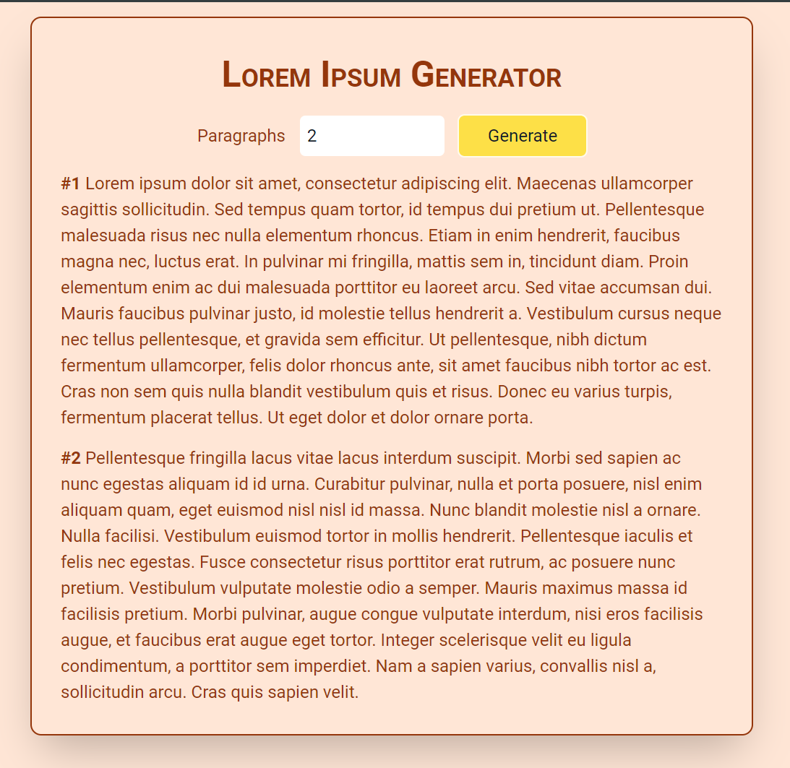

# Module #5 React day5 Homework Lorem Ipsum Generator App


## Hosted Version of the Project:
[m5react-day5-homework-lorem-ipsum-generator-app](https://m5react-day5-homework-lorem-ipsum-generator-app.vercel.app/)

## Objective
The Lorem Generator is a web-based application designed to generate placeholder text, often known as "Lorem Ipsum," for various design and content purposes. This tool allows users to specify the number of paragraphs they need and, with a simple click of a button, instantly generates the desired amount of lorem text.


## How to install and run in yours local machine
```bash
npm install
npm run start
```

## Tech. Stack Used:
+ [React](https://react.dev/)
+ [Google Fonts](https://fonts.google.com/)
+ [Font Awesome](https://fontawesome.com/icons/)

## Author
[Abhishek kumar](https://www.linkedin.com/in/alex21c/), ([Geekster](https://geekster.in/) MERN Stack FS-14 Batch)


